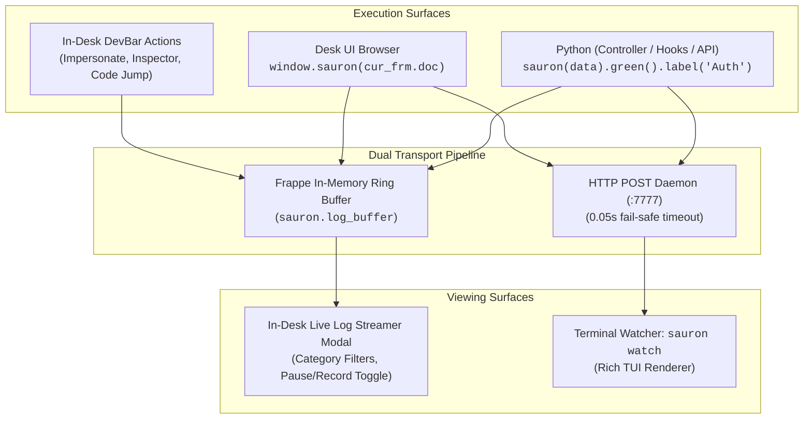

# Sauron — Real-Time Debugger & In-Desk DevBar

<div align="center">

```
  ____                                 
 / ___|  __ _ _   _ _ __ ___  _ __     
 \___ \ / _` | | | | '__/ _ \| '_ \    
  ___) | (_| | |_| | | | (_) | | | |   
 |____/ \__,_|\__,_|_|  \___/|_| |_|   
```

**Dual-Pipeline Real-Time Debugger & Floating Developer Toolbar for Frappe Framework and Python Applications**

*Inspired by Spatie Ray, Laravel Telescope, and modern developer toolbars — reimagined natively for Frappe & ERPNext.*

[](https://python.org)
[](https://frappeframework.com)
[](https://opensource.org/licenses/MIT)

</div>

---

## Overview

**Sauron** provides a unified debugging experience across both Python backend and Desk UI frontend. It routes execution traces, SQL queries, tabular data, and application state into a dual-pipeline transport:

1. **In-Desk Live Log Streamer & Floating DevBar (`Cmd+Shift+S`)**: An integrated browser toolbar and modal console embedded directly in Frappe Desk UI. No terminal switching required.
2. **Terminal Watcher (`sauron watch`)**: A rich, standalone terminal user interface (TUI) powered by Rich and Click for developers who prefer streaming logs alongside their bench processes.



---

## Key Features

### 1. In-Desk Floating DevBar (`Cmd+Shift+S` / `Ctrl+Shift+S`)
Press `Cmd+Shift+S` (macOS) or `Ctrl+Shift+S` (Linux/Windows) anywhere inside Frappe Desk:
- **Live Debug Logs**: View event count, toggle recording active/pause, and launch the in-browser log viewer.
- **Fast User Impersonation**: Instantly switch sessions between System Users (`Administrator`, Sales Manager, Auditor, etc.) with 1 click — no password or re-login required (strictly enabled in Developer Mode).
- **Active Form State Inspector**:
  - Displays current DocType and active Document ID.
  - **Dump Form to Log**: Transmits form state directly to Sauron live logs.
  - **Show Hidden**: Reveals hidden and system fields in the Desk form.
  - **Unlock Read-Only**: Unlocks read-only inputs for rapid form-state testing.
  - **Copy Form JSON**: Copies the entire `cur_frm.doc` structure to your clipboard.
- **1-Click IDE Code Jump**:
  - Select your preferred editor: **Zed**, **Cursor**, or **VSCode** (persisted to `localStorage`).
  - Click `[.py]`, `[.js]`, or `[.json]` to immediately open the corresponding controller, client script, or schema file in your editor.
- **Live SQL & N+1 Query Profiler**:
  - Real-time database execution counts and latency in milliseconds.
  - Automated N+1 query pattern detection with instant visual warning badges.
  - Drill-down drawer showing full query syntax and caller stack traces.
- **Bench Operations (Quick Actions)**:
  - **Clear Cache (`bench clear-cache`)**: 1-click purge of Redis document caches, user defaults, and website routes with instant toast feedback.
  - **Run Migrate (`bench migrate`)**: Spawns asynchronous background migration subprocess with safety confirmation dialog and mutex lock. Real-time stdout/stderr lines are streamed line-by-line into both the Live Log Viewer and Terminal Watcher without Gunicorn request timeouts.

### 2. In-Desk Live Log Streamer
Click **"Open Log Viewer"** from the DevBar:
- **Real-Time Streaming**: New debug calls appear instantaneously as formatted cards.
- **Recording Active / Pause Toggle**: Pause streaming during heavy operations so you can inspect payloads without layout shift.
- **Category Filter Tabs**: Isolate events by `All`, `Dumps`, `Tables`, `SQL`, or `Errors`.
- **Auto-Scroll & Clear**: Control viewport auto-scrolling or clear in-memory buffers with a single button.

### 3. Terminal Watcher TUI (`sauron watch`)
- **Nested Tree Visualizer**: Visualizes deep dictionaries, lists, and Frappe Document representations as collapsible trees.
- **Syntax Highlighting**: SQL queries formatted with syntax coloration and execution durations.
- **Clickable Origin Links**: Displays `file://` links directly to the calling file and line number in supporting terminals (macOS Terminal, iTerm2, WezTerm, Alacritty).
- **Execution Benchmark Cards**: High-precision stopwatch timers with contextual color thresholds (green < 50ms, yellow < 200ms, red >= 200ms).

---

## Installation

### Method A: As a Frappe Bench App (Recommended)

1. Clone or add the app to your Frappe bench:
   ```bash
   bench get-app https://github.com/<your-org>/sauron.git
   ```

2. Install the app to your active developer site:
   ```bash
   bench --site <your-site> install-app sauron
   ```

3. Rebuild desk assets:
   ```bash
   bench build --app sauron
   ```

4. Ensure `developer_mode` is enabled in your `site_config.json`:
   ```json
   {
     "developer_mode": 1
   }
   ```

### Method B: Standalone Python Package

Install directly in your Python virtual environment for standalone script or CLI usage:

```bash
pip install -e apps/sauron
# or with uv
uv pip install -e apps/sauron
```

---

## Usage Guide

### 1. Python Instrumentation

Sauron is automatically injected into Python's `builtins` upon Frappe initialization. You can call `sauron(...)` directly anywhere in controllers, hooks, or API methods without importing, or explicitly import it:

```python
import sauron

# 1. Basic variable dump
sauron("Order processed successfully")
sauron(doc)

# 2. Method chaining with colors and labels
sauron(user_doc).green().label("Authenticated User")
sauron(payload).red().label("Security Alert")
sauron(totals).purple().label("Financial Calculations")

# Supported colors: green, red, blue, yellow, purple, orange, gray
```

#### SQL Query Tracing
```python
sauron.sql(
    "SELECT item_code, item_name, standard_rate FROM `tabItem` WHERE disabled = 0 LIMIT 10;",
    duration_ms=4.25,
    label="Item Catalog Fetch",
)
```

#### Tabular Data
```python
sauron.table(
    [
        {"item_code": "EXC-001", "name": "Excavator 20T", "rate": 3500000, "status": "Available"},
        {"item_code": "GEN-100", "name": "Generator 100kVA", "rate": 1200000, "status": "Rented"},
    ],
    headers=["item_code", "name", "rate", "status"],
    label="Equipment Inventory",
    color="blue",
)
```

#### Execution Benchmark Timer
```python
with sauron.measure("Sales Invoice Tax Calculation"):
    doc.calculate_taxes_and_totals()
    doc.validate_mandatory_fields()
```

#### Exception Traceback Capture
```python
try:
    risky_operation()
except Exception as e:
    sauron.exception(e, label="Pipeline Failure")
    raise
```

#### Die and Dump (dd)
```python
# Dumps the target variable to Sauron in red and immediately terminates execution (sys.exit(1))
sauron.dd(response_payload)
# or
sauron.die(response_payload)
```

#### Clear Watcher Screen
```python
sauron.clear()
```

---

### 2. Browser & Desk UI JavaScript

In Frappe Desk UI, `window.sauron` is globally available:

```javascript
// Dump JavaScript objects directly from browser console or Client Scripts
sauron({ message: "Form refreshed", form_data: cur_frm.doc }, "Client Event", "purple");

// Simple string dump
sauron("Button clicked!", "Action", "green");
```

---

### 3. Terminal CLI Commands

Start the real-time terminal listener daemon:
```bash
sauron watch
# Or customize host and port
sauron watch --host 127.0.0.1 --port 7777
```

Dispatch a test suite to verify terminal formatting and rendering:
```bash
sauron test
```

Clear the active watcher terminal screen remotely:
```bash
sauron clear
```

---

## Environment Variables

| Variable | Default | Description |
| :--- | :--- | :--- |
| `SAURON_HOST` | `127.0.0.1` | Host address of the Sauron terminal listener daemon |
| `SAURON_PORT` | `7777` | Port of the Sauron terminal listener daemon |

---

## Security & Fail-Safe Architecture

1. **Zero Production Impact**: HTTP dispatch uses an ultra-short 0.05s timeout and swallows connection errors silently. If the terminal watcher is not running, execution continues without blocking or throwing errors.
2. **Developer Mode Protection**: All DevBar backend APIs (`switch_user`, `get_doctype_source`, `get_live_sql_stats`, `get_live_logs`) strictly require `developer_mode == 1` or `dev_server == True`. In production environments, these endpoints are completely disabled and will reject requests.

---

## Directory Layout

```
apps/sauron/
├── pyproject.toml              # Flit build configuration & dependencies
├── README.md                   # Project documentation
├── sauron/
│   ├── __init__.py             # Module initialization & builtin installer
│   ├── api.py                  # Whitelisted Frappe API endpoints (DevBar)
│   ├── cli.py                  # Click CLI implementation (watch, test, clear)
│   ├── client.py               # Sauron client & payload dispatch engine
│   ├── hooks.py                # Frappe app hooks (Desk JS/CSS injection)
│   ├── log_buffer.py           # In-memory thread-safe ring buffer for DevBar
│   ├── query_tracer.py         # Live SQL profiler & N+1 query detection
│   ├── server.py               # Rich TUI HTTP receiver daemon
│   └── public/
│       ├── css/                # DevBar UI stylesheets
│       ├── images/             # Eye of Sauron SVG icon
│       └── js/                 # Compiled Desk UI bundle
└── skills/
    └── sauron/
        └── SKILL.md            # AI Agent skill definition
```

---

## License

MIT License. See [LICENSE](LICENSE) for details.
