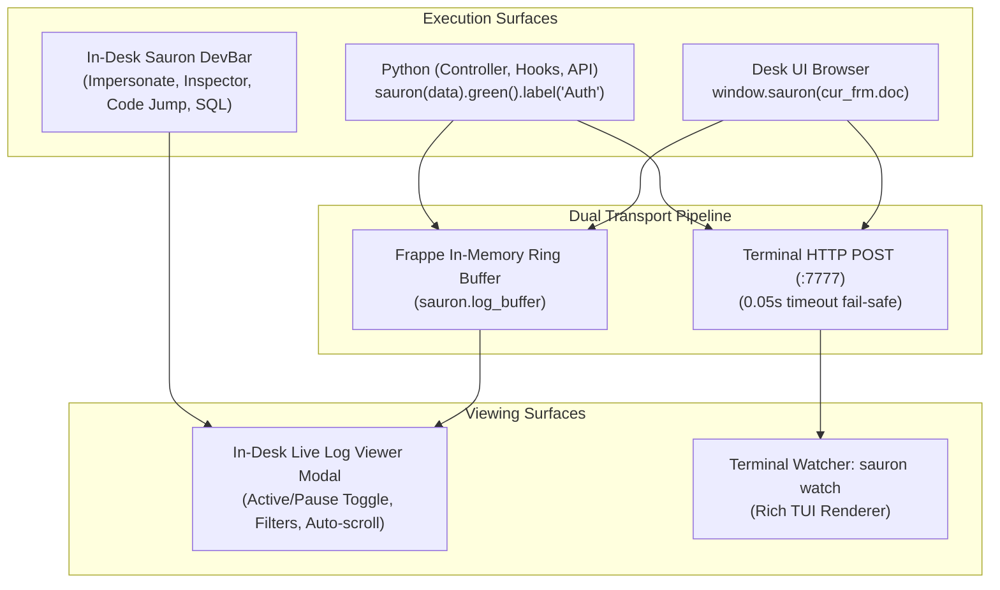

# Sauron Real-time Debugger & In-Desk DevBar (DX Suite)

Sauron is a dual-pipeline real-time debugger and in-browser developer toolbar designed for Frappe Framework and Python applications. It provides:
1. **In-Desk Live Log Streamer & Viewer**: Complete in-browser real-time console (Ray / Telescope alternative) with recording Active/Pause toggle, category filters (Dumps, Tables, SQL, Errors), and pretty-printed payload cards. No separate terminal required!
2. **In-Desk Floating DevBar (`Cmd+Shift+S`)**: 1-click Fast User Impersonation (switch roles instantly without logout/password), Form State Inspector (reveal hidden fields, unlock read-only, copy JSON), Multi-IDE Code Jump (Zed, Cursor, VSCode), and Live SQL & N+1 Query Profiler.
3. **Optional Terminal Watcher (`sauron watch`)**: Structured variable dumps, nested dictionary trees, SQL query tracing, benchmark timers, and caller stack traces in terminal.

---

## When to use

- Viewing real-time debug dumps directly in Desk UI without switching back and forth to terminal
- Pausing or muting debug streams on the fly during active testing
- Inspecting runtime variables and DocType documents without flooding console logs
- Profiling SQL query counts, database latency, and automatically detecting N+1 query patterns
- Testing multi-role permission matrices in Desk UI without typing passwords (Fast Impersonation)
- Inspecting hidden form fields, child tables, and dirty states in Desk UI browser
- Jumping directly from any Desk form to its Python controller or JS script in Zed, Cursor, or VSCode

---

## Architecture & Transport



---

## Features & Usage

### 1) In-Desk Live Log Streamer (No Terminal Required)

Click **`Open Log Viewer`** in the DevBar (or press `Cmd+Shift+S`):
- **Live Stream**: Debug events (`sauron(val)`, `sauron.table()`, `sauron.sql()`, exceptions) appear in real-time as formatted cards with timestamps, caller file:line links, and color badges.
- **Active / Pause Toggle**: Click `● Recording` to pause/mute logging during tests so you can inspect payloads without interference.
- **Category Filter Tabs**: Filter instantly between `All`, `Dumps`, `Tables`, `SQL`, and `Errors`.
- **Auto-scroll & Clear**: Toggle auto-scrolling or clear logs with 1 click.

---

### 2) Instrumenting Python Code

```python
import sauron

# Variable Dump with Color & Label
sauron(user_doc).green().label("Authenticated User")

# Tabular Data Rendering
sauron.table(doc.items, label="Line Items", color="purple")

# SQL Query Tracing
sauron.sql("SELECT name, status FROM `tabSales Order` LIMIT 5;", duration_ms=2.1)

# Execution Benchmark Timer
with sauron.measure("Invoice Calculation"):
    doc.calculate_taxes_and_totals()
```

---

### 3) In-Desk Floating DevBar (Browser Desk UI)

Press `Cmd+Shift+S` or `Ctrl+Shift+S` anywhere on Desk UI (`http://brightside.local:8888`):
1. **Live Debug Logs**: View total captured events, toggle recording active/pause, open in-browser log viewer.
2. **Fast User Impersonation**: Switch instantly between `Administrator`, sales, stock, and accounting roles without password.
3. **Active Form Inspector**:
   - Live DocType and DocName display.
   - **`Dump Form to Log`**: Dumps active form JSON to Sauron live log.
   - **`Show Hidden`**: Toggles visibility of hidden/system fields.
   - **`Unlock Read-Only`**: Unlocks read-only fields for fast debugging.
   - **`Copy Form JSON`**: Copies entire `cur_frm.doc` to clipboard.
4. **Quick Code Jump (IDE)**:
   - Select **Zed**, **Cursor**, or **VSCode** from the inline selector (persisted to `localStorage`).
   - Click `[.py]`, `[.js]`, or `[.json]` to launch your editor directly at the source code line.
5. **Live SQL & N+1 Query Profiler**:
   - Real-time query counts and execution duration in ms.
   - Automatic N+1 duplicate query pattern detection with red badge warning.
   - Drawer modal to inspect all SQL queries and caller stack traces.

---

### 4) Optional Terminal Watcher (`sauron watch`)

If you still prefer terminal output:
```bash
sauron watch
# Or
./scripts/dev-sauron
```
